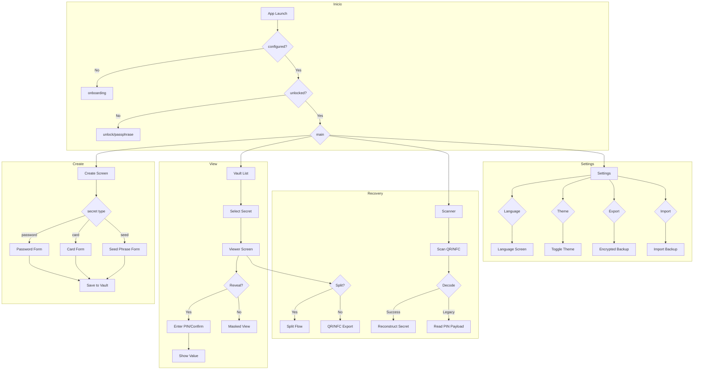
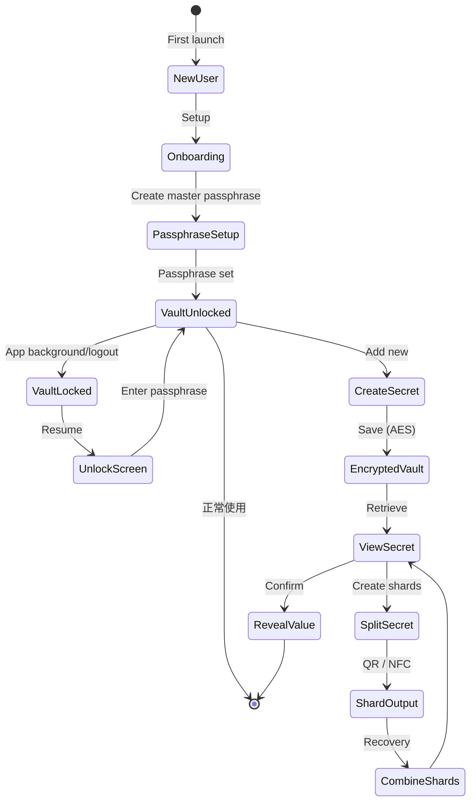
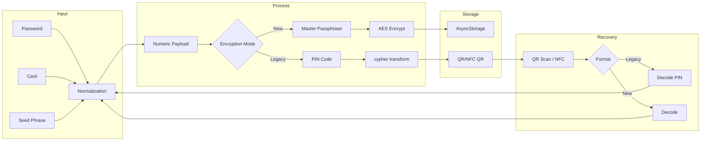

# SplitPass - Diagramas de Flujo

## Flujo de navigation Principal

```mermaid
flowchart TB
    subgraph Inicio
        A[App Launch] --> B{configured?}
        B -->|No| C[onboarding]
        B -->|Yes| D{unlocked?}
        D -->|No| E[unlock/passphrase]
        D -->|Yes| F{main}
    end

    subgraph Create
        F --> G[Create Screen]
        G --> H{secret type}
        H -->|password| I[Password Form]
        H -->|card| J[Card Form]
        H -->|seed| K[Seed Phrase Form]
        I --> L[Save to Vault]
        J --> L
        K --> L
    end

    subgraph View
        F --> M[Vault List]
        M --> N[Select Secret]
        N --> O[Viewer Screen]
        O --> P{Reveal?}
        P -->|Yes| Q[Enter PIN/Confirm]
        Q --> R[Show Value]
        P -->|No| S[Masked View]
    end

    subgraph Recovery
        O --> T{Split?}
        T -->|Yes| U[Split Flow]
        T -->|No| V[QR/NFC Export]
        F --> W[Scanner]
        W --> X[Scan QR/NFC]
        X --> Y{Decode}
        Y -->|Success| Z[Reconstruct Secret]
        Y -->|Legacy| AA[Read PIN Payload]
    end

    subgraph Settings
        F --> AB[Settings]
        AB --> AC{Language}
        AC --> AD[Language Screen]
        AB --> AE{Theme}
        AE --> AF[Toggle Theme]
        AB --> AG{Export}
        AG --> AH[Encrypted Backup]
        AB --> AI{Import}
        AI --> AJ[Import Backup]
    end
```

## Flujo de Seguridad

```mermaid
stateDiagram-v2
    [*] --> NewUser: First launch
    NewUser --> Onboarding: Setup
    Onboarding --> PassphraseSetup: Create master passphrase
    PassphraseSetup --> VaultUnlocked: Passphrase set
    VaultUnlocked --> VaultLocked: App background/logout
    VaultLocked --> UnlockScreen: Resume
    UnlockScreen --> VaultUnlocked: Enter passphrase
    VaultUnlocked --> [*]:正常使用
    
    VaultUnlocked --> CreateSecret: Add new
    CreateSecret --> EncryptedVault: Save (AES)
    EncryptedVault --> ViewSecret: Retrieve
    ViewSecret --> RevealValue: Confirm
    RevealValue --> [*]
    
    ViewSecret --> SplitSecret: Create shards
    SplitSecret --> ShardOutput: QR / NFC
    ShardOutput --> CombineShards: Recovery
    CombineShards --> ViewSecret
```

## Flujo de Datos

```mermaid
flowchart LR
    subgraph Input
        A[Password] --> D[Normalization]
        B[Card] --> D
        C[Seed Phrase] --> D
    end

    subgraph Process
        D --> E[Numeric Payload]
        E --> F{Encryption Mode}
        F -->|New| G[Master Passphrase]
        F -->|Legacy| H[PIN Code]
        G --> I[AES Encrypt]
        H --> J[cypher transform]
    end

    subgraph Storage
        I --> K[AsyncStorage]
        J --> L[QR/NFC QR]
    end

    subgraph Recovery
        L --> M[QR Scan / NFC]
        M --> N{Format}
        N -->|Legacy| O[Decode PIN]
        N -->|New| P[Decode]
        O --> D
        P --> D
    end
```